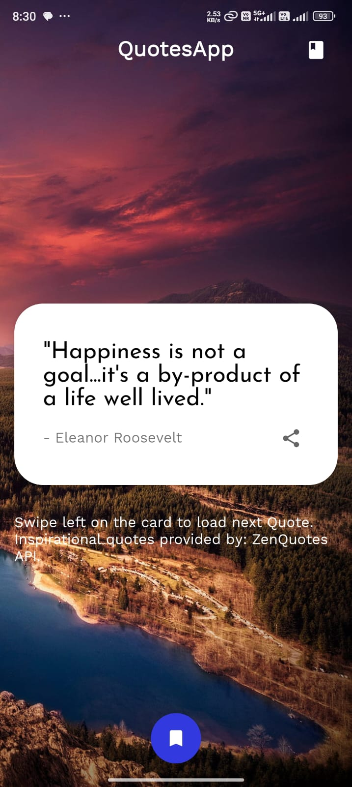

# Quote of the Day App


The Quote of the Day App provides daily inspiring quotes to motivate and uplift users. Each day, a new quote is displayed, offering wisdom and insight to brighten your day.

## Table of Contents

- [Features](#features)
- [Screenshots](#screenshots)
- [Installation](#installation)
- [Usage](#usage)
- [Contributing](#contributing)
- [Contact](#contact)
- [Demo](#demo)

## Features

- **Home Screen**: Display a random inspiring quote or message of the day.
- **Quote Refresh**: Automatically update the quote daily or on app launch.
- **Share Quote**: Allow users to share the current quote with others via messaging or social media.
- **Favorite Quotes**: Provide an option for users to save and view their favorite quotes.
- **User Interface**: Attractive and user-friendly interface.

## Screenshots

Include some screenshots of your app to give users a visual idea of what your app looks like.

<div>
    
    
    
</div>

## Installation

### Prerequisites

- Android Studio installed on your machine
- A device or emulator to run the app

### Steps

1. Clone the repository:
    ```bash
    git clone https://github.com/nihalahmed07/CODSOFT-TASK-SUBMISSION.git

    ```
2. Open the project in Android Studio.
3. Let Android Studio install any required dependencies.
4. Build and run the app on your device or emulator.

## Usage

1. Open the app to view the quote of the day.
2. Swipe left browse new quotes.
3. Tap the bookmark icon to save a quote to your favorites.
4. Use the share button to share quotes on social media.

## Contributing

Contributions are welcome! If you'd like to contribute, please fork the repository and use a feature branch. Pull requests are warmly welcomed.

1. Fork the repository.
2. Create a new branch:
    ```bash
    git checkout -b feature/YourFeature
    ```
3. Make your changes.
4. Commit your changes:
    ```bash
    git commit -m 'Add some feature'
    ```
5. Push to the branch:
    ```bash
    git push origin feature/YourFeature
    ```
6. Create a new pull request.

## Contact

Nihal Ahmed - [n.nihalahmed1@gmail.com](mailto:n.nihalahmed1@gmail.com)

Project Link: [https://github.com/nihalahmed07/Task2 Quote of the Day](https://github.com/nihalahmed07/CODSOFT-TASK-SUBMISSION/tree/main/TASK2%20Quote%20of%20the%20Day)

## Demo

Check out a video demo of the application on YouTube: [Click here for demo](https://youtube.com/shorts/Zuel9pAEvjI?feature=share)
